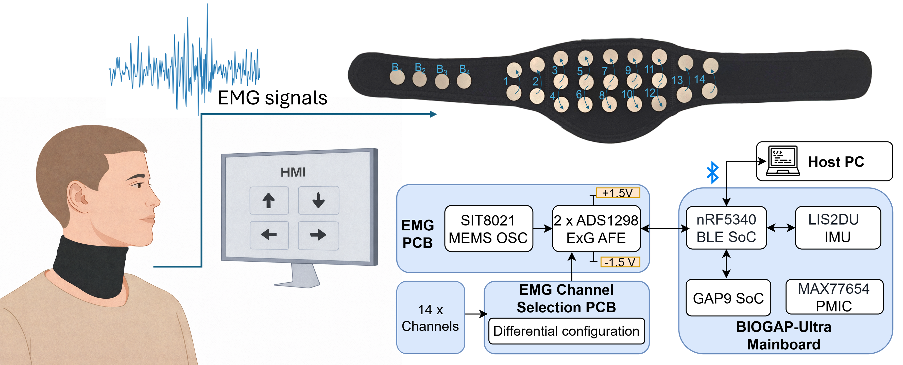
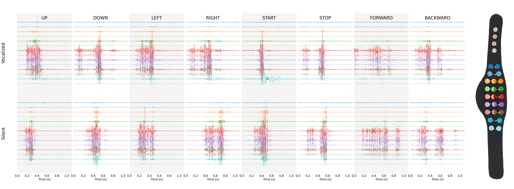

# SilentWear: an Ultra-Low Power Wearable System for EMG-based Silent Speech Recognition

*Silent-Wear* is an end-to-end, fully open-source wearable system for *vocalized* and *silent* speech detection from surface electromyography (sEMG) data.

<table align="center">
<tr>
<td align="center">
<br>
</td>
<td align="center">
<br>
</td>
</tr>
</table>

### ⚙️ General Overview of the System
*Silent-Wear* relies on the following building blocks:

🔧 **BIOGAP-Ultra** — an ultra-low-power acquisition system for biopotential acquisition.  
Hardware and firmware: https://github.com/pulp-bio/BioGAP

📿 **Silent-Wear neckband** — a 14-channel differential EMG neckband.  
System overview: https://ieeexplore.ieee.org/abstract/document/11330464 (arXiv: https://arxiv.org/abs/2509.21964)

🖥️ **BIOGUI** — a modular PySide6 GUI for acquiring and visualizing biosignals from multiple sources, and for managing data collection.  
Version used in this work: https://github.com/pulp-bio/biogui/tree/sensors_speech

📝 **This repository**  
This repository contains the source code used to preprocess EMG data and develop models that predict *8 HMI* commands from *vocalized* and *silent* EMG, in line with the associated paper (arXiv: TBD).

Specifically, it allows you to:
1. **Preprocess EMG data** and prepare it for model training using our publicly available dataset: https://huggingface.co/datasets/PulpBio/SilentWear
2. **Replicate the results** reported in the paper (arXiv: coming soon). See details below.
3. **Extend the pipeline** with your own models (instructions below).


## 🛠 Get Started: Environment Setup

Start by creating a dedicated virtual environment:

If using **conda**
```bash
conda create -n silent_wear python=3.11.9
conda activate silent_wear
```

If using **venv**
```bash
python3.11 -m venv silent_wear
source silent_wear/bin/activate
```

Clone this repository and install the required dependencies:

```bash
git clone <REPO_URL>
cd SilentWear
pip install -r requirements.txt
```


## Donwload the Data

You can download the data used in this work from: https://huggingface.co/datasets/PulpBio/SilentWear

The code expects the Hugging Face release layout:

```text
DATA_DIR/
├── data_raw_and_filt/
└── wins_and_features/
```

Before starting your experiments, change the data paths in: ```config/paper_models_config.yaml``` and ```config/create_windows.yaml```

If you want to collect your own data using your own recordings from, see **Optional: raw data preprocessing** below.

## Reproduce Paper Results
The ```script``` folder allows to reproduce the results of the paper. </br>

### Step 1: Prepare EMG-windows and (optionally) features

```bash
cd reproduce_paper_scripts
python 20_make_windows_and_features.py --data_dir ./path_to_your_data
```

This reads your data and create windows and features, which will be used to run the ITR ablations. 

### Step 2: Run Experiments

#### Global Evaluation Setting

Random Forest
```bash
python reproduce_paper_scripts/30_run_experiments.py --base_config config/paper_models_config.yaml --model_config config/models_configs/random_forest_config.yaml --data_dir ./data --artifacts_dir ./artifacts --experiment global
```

SpeechNet
```bash
python reproduce_paper_scripts/30_run_experiments.py --base_config config/paper_models_config.yaml --model_config config/models_configs/speechnet_config.yaml --data_dir ./data --artifacts_dir ./artifacts --experiment global
```


#### Inter-Session Evaluation Setting

Random Forest
```bash
python reproduce_paper_scripts/30_run_experiments.py --base_config config/paper_models_config.yaml --model_config config/models_configs/random_forest_config.yaml --data_dir ./data --artifacts_dir artifacts --experiment inter_session --inter_session_windows_s 1.4
```

Speech Net
```bash
python reproduce_paper_scripts/30_run_experiments.py --base_config config/paper_models_config.yaml --model_config config/models_configs/speechnet_config.yaml --data_dir ./data --artifacts_dir artifacts --experiment inter_session
```
Note: this will run by default all the ablations on the window size. Window sizes: [0.4, 0.6, 0.8, 1.0, 1.2, 1.4].
You can pass a single float value if you want to train only on one specific window size. 


#### Training From Scratch
```bash
python reproduce_paper_scripts/30_run_experiments.py --base_config config/paper_models_config.yaml --model_config config/models_configs/speechnet_config.yaml --data_dir ./data--artifacts_dir artifacts --experiment train_from_scratch --tfs_config config/paper_train_from_scratch_config.yaml --tfs_windows_s 1.4
```
Adjust tfs_windows_s to select a different window size


#### Inter-Session Fine Tuning
```bash
python reproduce_paper_scripts/30_run_experiments.py --base_config config/paper_models_config.yaml --model_config config/models_configs/speechnet_config.yaml --data_dir ./data --artifacts_dir artifacts --experiment inter_session_ft --ft_config config/paper_ft_config.yaml --ft_windows_s 1.4
```
Adjust ft_windows_s to select a different window size


### Step 3: Generate results 

Run these commands to generate the results

#### Global / Inter Session Experiments Results

Random Forest:

```bash
python utils/III_results_analysis/I_global_intersession_analysis.py --artifacts_dir ./artifacts --experiment global --model_name random_forest --model_name_id w1400ms 
```
SpeechNet:
```bash
  python utils/III_results_analysis/I_global_intersession_analysis.py --artifacts_dir ./artifacts --experiment global --model_name speechnet --model_name_id w1400ms --plot_confusion_matrix --transparent
```

Switch experiment between global and inter_session.

#### ITR on SpeechNet
```bash
  python utils/III_results_analysis/II_infotransrate.py --artifacts_dir ./artifacts --experiment inter_session --model_name speechnet
```


#### Fine-Tuning + From -Scratch Evaluations
```bash
python utils/III_results_analysis/III_ft_results.py --artifacts_dir ./artifacts --model_name speechnet --model_base_id w1400ms --inter_session_model_id model_1
--ft_id ft_config_0 --bs_id bs_config_0 
```
Note:

If you runned multiple fine tuning or baseline rounds for the same window size, adjust ft_id and bs_id accordingly.
If you ran the inter session models multiple times, chage the inter_session_model_id

### Run minimal experiments.

The ```script``` folder is built around the standalone scripts contained in:

a) ```utils/II_feature_extraction``` and ```utils/III_results_analysis```

b) ```offline_experiments```

The script in these folder can be runned independently

They can be used as a starting point to **test your own model**

---

## Extras: raw data preprocessing (only if you collected new data)

If you recorded new data using the BioGUI, you can convert your `.bio` recordings to `.h5` using:

```text
utils/I_data_preparation/data_preparation.py
```

Then run windowing/feature extraction as above.

---


## 🛠 Contribute

*Silent-Wear* is aimed to promote a community-effort to develop novel EMG-based HMI.

We strongly encourage you to *contribute* to our project.

How to contribute?

### Collect and add your-own data: 
You can use the open source bio-gui to replicate the data collection protocol employed in this work. 

### Develop your own model 


## Citation

If you use this work, we strongly encourage you to cite:


```bibtex
@online{spacone_silentwear_26,
  author = {Spacone, Giusy and Frey, Sebastian and Pollo, Giovanni and Burrello, Alessio and Pagliari, J. Daniele and Kartsch, Victor and Cossettini, Andrea and Benini, Luca},
  title = {SilentWear: An Ultra-Low Power Wearable System for EMG-Based Silent Speech Recognition},
  year = {2026},
  url = {https://arxiv.org/placeholder}
}
```
```
@INPROCEEDINGS{meier_wearneck_26,
  author={Meier, Fiona and Spacone, Giusy and Frey, Sebastian and Benini, Luca and Cossettini, Andrea},
  booktitle={2025 IEEE SENSORS}, 
  title={A Parallel Ultra-Low Power Silent Speech Interface Based on a Wearable, Fully-Dry EMG Neckband}, 
  year={2025},
  volume={},
  number={},
  pages={1-4},
  keywords={Wireless communication;Vocabulary;Wireless sensor networks;Accuracy;Low power electronics;Electromyography;Robustness;Decoding;Wearable sensors;Textiles;EMG;wearable;ultra-low power;HMI;speech;silent speech},
  doi={10.1109/SENSORS59705.2025.11330464}}
```