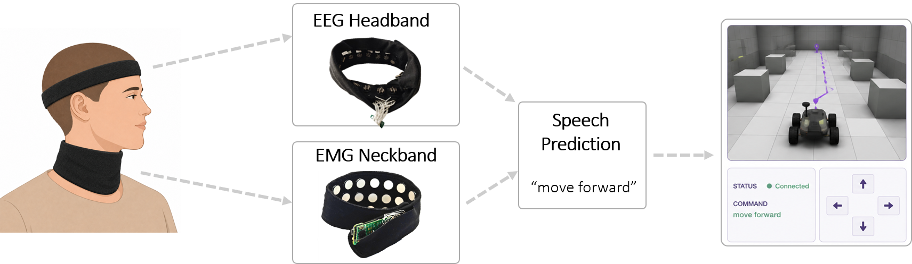
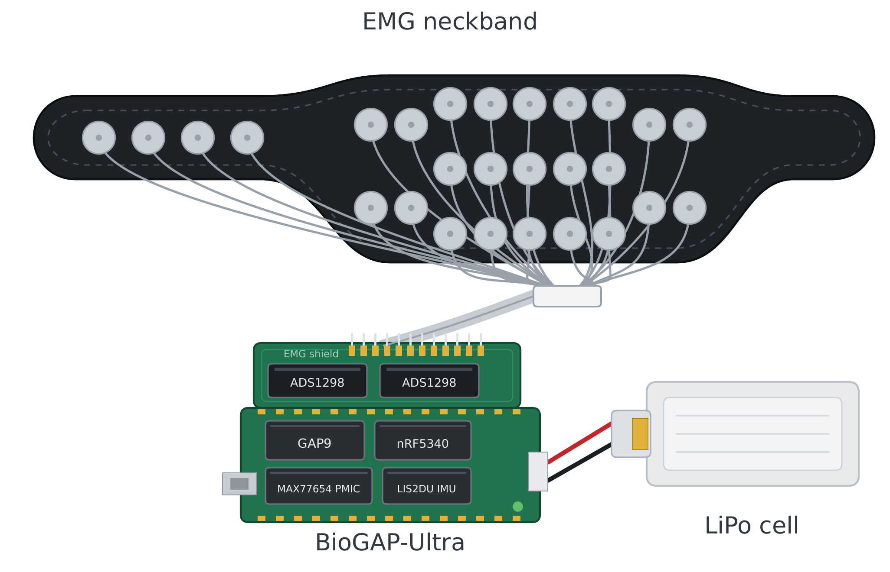
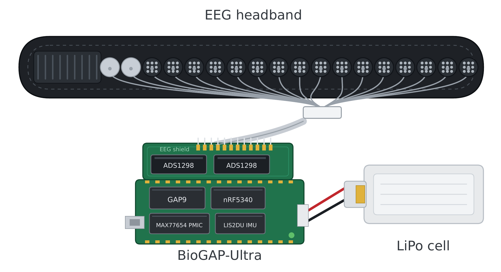

# From Biosignals to Words: Exploiting Novel Deep Learning Architectures for Speech Understanding

This repository is a fork of [pulp-bio/SilentWear](https://github.com/pulp-bio/SilentWear),
extended for the master's thesis *From Biosignals to Words: Exploiting Novel Deep
Learning Architectures for Speech Understanding* (ETH Zurich, 2026).

Fork: <https://github.com/carolabonamico/SilentWear>

<table align="center">
  <tr>
    <td align="center">
      <br>
    </td>
  </tr>
</table>

## Contributors

The SilentWear system was developed at ETH Zurich by the
[PULP-Bio](https://iis-projects.ee.ethz.ch/index.php?title=Biomedical_Circuits,_Systems,_and_Applications)
team. The contributors are listed in the
[original repository](https://github.com/pulp-bio/SilentWear).

The work in this fork was carried out by **Carola Bonamico** as a contributor to the project. It covers the sentence-level corpus acquisition with the paired EMG and EEG setup, the CTC training and decoding path, the sequence stages compared in the thesis, the evaluation protocols and metrics, and the ablation studies.

## System Components

**BioGAP-Ultra**: ultra-low-power acquisition platform for biopotentials. 
Hardware and firmware: <https://github.com/pulp-bio/BioGAP>

**SilentWear neckband**: 14-channel differential dry-electrode EMG neckband.
System overview: <https://ieeexplore.ieee.org/abstract/document/11330464>
(arXiv: <https://arxiv.org/abs/2509.21964>)

<table align="center">
  <tr>
    <td align="center">
      <br>
    </td>
  </tr>
</table>

**EEG headband**: 16-channel dry-electrode EEG headband.
System overview: <https://ieeexplore.ieee.org/stamp/stamp.jsp?arnumber=11346484>
(arXiv: <https://arxiv.org/abs/2508.13728>)

<table align="center">
  <tr>
    <td align="center">
      <br>
    </td>
  </tr>
</table>

**BioGUI**: Qt application for acquisition, utterance presentation and labelling.
The version used in this work is the fork <https://github.com/carolabonamico/biogui>

## What This Fork Adds

* A corpus of fifteen isolated words and twenty full sentences both plus a rest class, recorded from seven participants over six sessions in vocalized and silent conditions.
* A CTC training and decoding path over character tokens, with greedy best-path and prefix beam search.
* Two sequence stages compared at equal number of parameters, namely a two-layer BiLSTM and a Transformer encoder, on top of the shared convolutional backbone, which may also be run on its own.
* Two tasks, namely closed-set classification against the lexicon and free-character continuous recognition.
* Configurations of the models input domain (time, STFT, MFCC).
* Ablations on the number of recorded sessions and on the sliding-window augmentation.
* Pooled multi-subject models.

## Environment Setup

Start by creating a dedicated virtual environment:

If using **conda**

```bash
conda create -n silent_wear python=3.11.9
conda activate silent_wear
```

If using **venv**

```bash
python3.11 -m venv silent_wear
source silent_wear/bin/activate
```

Clone this repository and install the required dependencies:

```bash
git clone <REPO_URL>
cd SilentWear
pip install -r requirements.txt
```

## Data

The word-level corpus published with the paper is available at <https://huggingface.co/datasets/PulpBio/SilentWear> and is used in the thesis to reproduce the SpeechNet baseline. The corpus recorded for the thesis is not yet public.

Data paths are set in the configuration files of `config_thesis/`, which is the configuration folder of the thesis.

```bash
# .bio recordings -> filtered, labeled HDF5 tables
python utils/I_data_preparation/data_preparation.py --data_dir <RAW_DIR>

# HDF5 tables -> fixed-length windows (and, optionally, handcrafted features)
python reproduce_paper_scripts/20_make_windows_and_features.py \
  --config config_thesis/create_windows_sentences.yaml \
  --data_dir <RAW_DIR> --windows_s 2.0 --label_mode sentence
```

The window length, the label mode and the sliding-window augmentation are declared in `config_thesis/create_windows*.yaml`.

### Where the data has to live

The reproduction scripts of `scripts/reproduce_thesis/` read three corpus roots, each with a default name and an environment variable that overrides it. The defaults are declared in `scripts/reproduce_thesis/common.sh`.

| root | override | holds |
|---|---|---|
| `data_sentences/` | `DATA_SENTENCES` | The sentence corpus of the thesis: 7 participants, 6 sessions, 20 sentences |
| `data_words/` | `DATA_WORDS` | The word corpus of the thesis: 15 command words plus rest |
| — | `DATA_WORDS_PUBLISHED` | The published SilentWear corpus: 8 command words plus rest |

Inside a root the layout is fixed, and the folder names are the ones the configurations select through `paths.processed` and `paths.win_and_feats`:

```
<root>/
  raw/<subject>/<condition>/*.bio                     # optional, the unfiltered recordings
  raw_and_processed/<subject>/<condition>/*.h5        # filtered, labelled tables
  wins_and_features/<subject>/<condition>/WIN_<ms>/   # trigger-aligned windows, one folder per window length
  wins_and_features_onset/<subject>/<condition>/WIN_<ms>/   # trigger-free windows, sentences only
```

## Aligning the EMG and EEG Recordings

The two BioGAP-Ultra units write independent `.bio` files, so a session is a pair of recordings that has to be aligned. The scripts of `utils/V_data_alignment/` align the pair and then measure the delay that is left. `inter_file_alignment.py` first repairs each file on its own and then maps the second file onto the first
through the trigger sequence the two share.

```bash
python utils/V_data_alignment/inter_file_alignment.py \
  emg_mic_<N>_<TS>.bio eeg_mic_<N>_<TS>.bio <OUT_DIR> --debug
```

`compute_peak_delay.py` measures the residual delay on a periodic stimulus recorded by both boards and by the microphone of each. It detects the onsets of every available signal by high-pass filtering, rectification and thresholding, at most one onset per period, clusters the onsets closer than half a period into a single event, and writes the delays with their mean and standard deviation to a CSV.

```bash
python utils/V_data_alignment/compute_peak_delay.py \
  <OUT_DIR>/emg_mic_<N>_<TS>_inter_aligned.bio \
  <OUT_DIR>/eeg_mic_<N>_<TS>_inter_aligned.bio \
  --output-dir utils/V_data_alignment/results/b2
```

The same command runs on the raw files, and compares the CSVs is what shows the effect of the alignment. The intra-file repair and the packet-loss report also run on their own:

```bash
python utils/V_data_alignment/align_bio_signals.py <FILE>.bio <OUT_DIR> --debug
python utils/V_data_alignment/check_packet_loss.py <FILE>.bio
```

## Running the Experiments

Every run composes a **base** configuration, which contains the corpus, the window length, the label set and the cross-validation scheme, with a **model** configuration, which explicits the architecture, the input domain and the objective.
The base configurations used in the thesis are the `config_thesis/thesis_base_*.yaml` files, and the model configurations live in `config_thesis/models_configs/`, named `<corpus>_<domain>_<objective>_<sequence>[_<task>_<decoder>].yaml`. See `config_thesis/README.md` for the full map from configuration to result.

The scripts under `scripts/reproduce_thesis/` wrap the commands below, one per step of the chain, and `run_all.sh` executes them in order. The folder `single/` holds one script per experiment unit, for running them separately. The commands are given here directly so that a single experiment can be run without the wrappers.

### Global and inter-session protocols

The `--experiment` flag selects the protocol. `global` is five-fold stratified cross-validation over the whole corpus of a participant, `inter_session` is leave-one-session-out over the recording sessions.

BiLSTM, STFT input representation, CTC, sentence classification:

```bash
python reproduce_paper_scripts/30_run_experiments.py \
  --base_config config_thesis/thesis_base_sentences_w2000_rest.yaml \
  --model_config config_thesis/models_configs/sentences_stft_ctc_bilstm_classification_greedy.yaml \
  --data_dir <DATA_DIR> --artifacts_dir artifacts_sentences \
  --experiment global --subjects S01 S02 S03 S04 S05 S06 S07 \
  --conditions silent vocalized
```

Transformer sequence stage, same protocol:

```bash
python reproduce_paper_scripts/30_run_experiments.py \
  --base_config config_thesis/thesis_base_sentences_w2000_rest.yaml \
  --model_config config_thesis/models_configs/sentences_stft_ctc_transformer_classification_greedy.yaml \
  --data_dir <DATA_DIR> --artifacts_dir artifacts_sentences \
  --experiment inter_session
```

The three input domains are selected by the model configuration alone. The matrix `<corpus>_<domain>_<objective>_<sequence>.yaml` covers {words, sentences} × {time, stft, mfcc} × {cross-entropy, CTC} × {none, BiLSTM, transformer}, so a domain comparison is three runs differing in one field:

```bash
for DOMAIN in time stft mfcc_b64_q40; do
  python reproduce_paper_scripts/30_run_experiments.py \
    --base_config config_thesis/thesis_base_sentences_w2000_rest.yaml \
    --model_config config_thesis/models_configs/sentences_${DOMAIN}_ctc_bilstm_classification_greedy.yaml \
    --data_dir <DATA_DIR> --artifacts_dir artifacts_domains \
    --experiment global
done
```

Continuous recognition is the same run with the decoding key switched from `lexicon` to `recognition` in the model configuration, which widens the head to the English alphabet. The `*_recognition_*.yaml` files of `config_thesis/models_configs/` are those variants.

### Prefix beam search sweep

The sweep re-decodes the frame log-probabilities saved beside every fold checkpoint. Train once with the dump enabled, then sweep:

```bash
python offline_experiments/VII_beam_sweep.py \
  --dumps artifacts_beam_sweep/<RUN>/models/global \
  --lexicon lexicon/silentwear_lexicon_sentences.txt \
  --beam_widths 1 5 10 25 \
  --temperatures 1.0 1.3 1.6 2.0 \
  --blank_penalties 0.0 1.0 2.0 4.0 \
  --length_bonuses 0.0 0.5 1.0 2.0 \
  --out artifacts_beam_sweep/<RUN>/beam_sweep_global.csv
```

The grid is scoped to one protocol at a time so that the global and inter-session savings are never pooled. The selected operating point is written per condition to `tables_beam/`, and the greedy reference is recomputed from the same savings.

### Ablation on the number of recorded sessions

This ablation retrains on the first 1 to 6 sessions of each participant. The inter-session protocol is defined from two sessions onwards.

```bash
python reproduce_paper_scripts/30_run_experiments.py \
  --base_config config_thesis/thesis_base_words_w1400_rest.yaml \
  --model_config config_thesis/models_configs/speechnet_baseline_words_ce.yaml \
  --data_dir <DATA_WORDS> --artifacts_dir artifacts_ablation/session_count \
  --experiment session_count_ablation \
  --subjects S01 S03 S04 --conditions silent vocalized \
  --session_windows_s 1.4 --min_sessions 1
```

### Ablation on the sliding-window augmentation

Two sweeps vary one parameter at a time against an un-augmented baseline, the stride and the number of shifts per side. Both are declared in the windowing configuration, so each point of the sweep is one windowed dataset and one run:

```bash
# Set data_augmentation.stride_ms to 10, 20, 50 or 100 in the windowing
# configuration, at num_strides: 2, before each point of the sweep.
python reproduce_paper_scripts/20_make_windows_and_features.py \
  --config config_thesis/create_windows_words.yaml \
  --data_dir <DATA_WORDS> --windows_s 1.4 --label_mode word

python reproduce_paper_scripts/30_run_experiments.py \
  --base_config config_thesis/thesis_base_words_w1400_rest.yaml \
  --model_config config_thesis/models_configs/speechnet_baseline_words_ce.yaml \
  --data_dir <DATA_WORDS> --artifacts_dir artifacts_ablation/stride50_n2 \
  --experiment session_count_ablation --subjects S01 S03 S04 \
  --session_windows_s 1.4 --min_sessions 1
```

The shift-count sweep is the same with `num_strides` in {2, 5, 10} at a 10 ms stride. Setting the augmentation modality to `original_size` in the windowing configuration resamples the augmented pool back to the cardinality of the base split.

The shell wrappers for both ablations are `scripts/reproduce_thesis/single/60_ablation_session_count.sh` and `scripts/reproduce_thesis/single/60_ablation_augmentation.sh`.

### Pooled multi-subject models

One model is trained on all participants at once, with a per-subject z-score or with a per-subject min-max scaling.
The three base configurations differ in that field alone, and the runs are `60_pooled_none.sh`, `60_pooled_zscore.sh` and `60_pooled_minmax.sh` under `scripts/reproduce_thesis/single/`.

## Generate results

Per-fold metrics are written to a `cv_summary.csv` beside every set of checkpoints, and every scalar of the metrics dictionary becomes a column. The aggregate tables land under `tables/`, and the folders of `artifacts_thesis/` follow the scripts of
`scripts/reproduce_thesis/`:

| Folder | Content description |
|---|---|
| `01_gate_baseline_published/` | SpeechNet reproduced on the published corpus, CE and CTC, plus the STFT and BiLSTM upgrade |
| `02_gate_baseline_new_corpus/` | Same models on the word subset of the thesis |
| `10_axis1_input_domain/` | Four input domains × two sequence stages, words and sentences, CE |
| `11_axis1_ctc_domains/` | Time and mel rows of the same table under CTC |
| `20_axis2_objective/` | STFT rows under CTC, words and sentences |
| `30_axis3_sequence_stage/` | Backbone alone, BiLSTM and Transformer, both tasks, plus the mel counterparts |
| `40_axis4_decoder_sweep/` | Beam sweep, both tasks and both architectures |
| `50_axis5_trigger_free/` | Models retrained on onset-anchored windows | — |
| `60_ablations/` | Enrolment sessions, sliding-window augmentation, pooled models |
| `embeddings/` | Encoder activations projections ||

## Analysing the Results

The analysis scripts detect the run mode from the columns of `cv_summary.csv`, `balanced_accuracy` for classification and `wer` for recognition.

```bash
# per-subject and pooled tables, plus confusion matrices
python utils/III_results_analysis/I_global_intersession_analysis.py \
  --artifacts_dir artifacts_sentences --experiment global \
  --model_name speechnet_transformer --model_name_id w2000ms \
  --plot_confusion_matrix

# the sweep-selected beam configuration, per condition and protocol
python utils/III_results_analysis/VII_beam_sweep_tables.py \
  --artifacts_dir artifacts_beam_sweep/<RUN> --experiment global \
  --model_name speechnet_transformer --model_name_id w2000ms

# ablation figures
python utils/IV_plots/plot_ablation_results.py \
  --artifacts_root artifacts_ablation --out_dir figures

# the 21-class sentence results, greedy against the selected beam
python utils/III_results_analysis/aggregate_rest_sentence_results.py

# the same table for the 20-class runs, or at another window
python utils/III_results_analysis/aggregate_rest_sentence_results.py \
  --root artifacts_beam_sweep_no_rest --window w2000ms
```

The trigger-free detector is scored on its own and against the trigger by `utils/I_data_preparation/onset_detection_report.py`.

## Extending the Pipeline

To add a model, place its configuration under `config_thesis/models_configs/`, implement it under `models/cnn_architectures/` and register it in `models/models_factory.py`. Task behaviour, that is the loss and the decoding, is owned by the strategies in `models/strategies.py`.

## Citation

If you use this work, please cite the SilentWear system and the platform it runs on:

```bibtex
@article{spacone2026silentwear,
  title={SilentWear: an Ultra-Low Power Wearable System for EMG-based Silent Speech Recognition},
  author={Spacone, Giusy and Frey, Sebastian and Pollo, Giovanni and Burrello, Alessio and Pagliari, Daniele Jahier and Kartsch, Victor and Cossettini, Andrea and Benini, Luca},
  journal={arXiv preprint arXiv:2603.02847},
  year={2026}
}
```

```bibtex
@inproceedings{meier_wearneck_26,
  author={Meier, Fiona and Spacone, Giusy and Frey, Sebastian and Benini, Luca and Cossettini, Andrea},
  booktitle={2025 IEEE SENSORS},
  title={A Parallel Ultra-Low Power Silent Speech Interface Based on a Wearable, Fully-Dry EMG Neckband},
  year={2025},
  pages={1-4},
  doi={10.1109/SENSORS59705.2025.11330464}}
```

```bibtex
@article{frey_biogapultra_26,
  author={Frey, Sebastian and Spacone, Giusy and Cossettini, Andrea and Guermandi, Marco and Schilk, Philipp and Benini, Luca and Kartsch, Victor},
  journal={IEEE Transactions on Biomedical Circuits and Systems},
  title={BioGAP-Ultra: A Modular Edge-AI Platform for Wearable Multimodal Biosignal Acquisition and Processing},
  year={2026},
  pages={1-17},
  doi={10.1109/TBCAS.2026.3652501}}
```

## License

* Apache License 2.0, see [LICENSE](LICENSE).
* Images under `extras/` are released under the Creative Commons Attribution 4.0
  International License, see [LICENSE_IMG](LICENSE.images).
