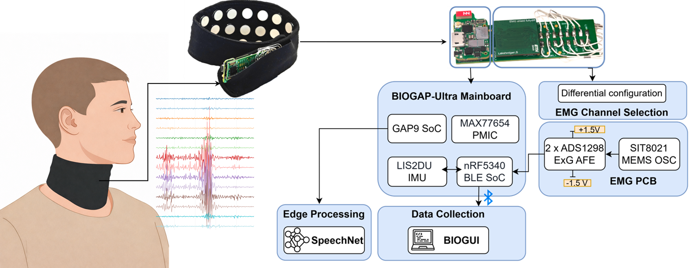
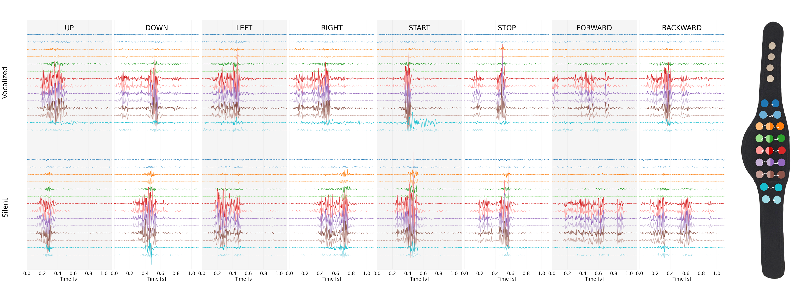
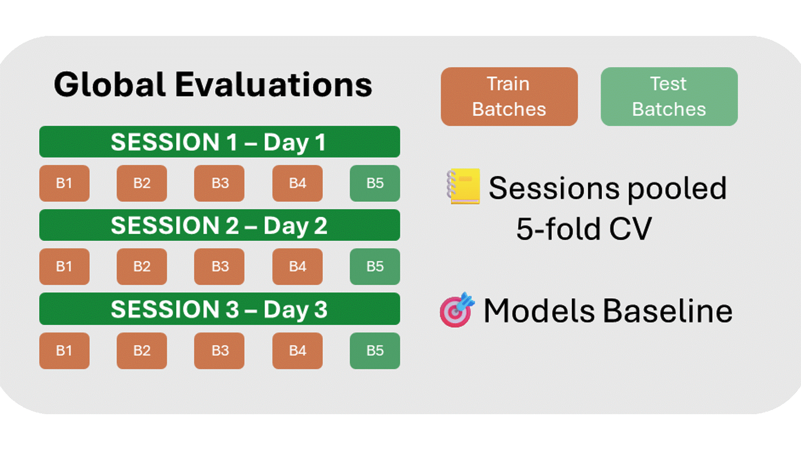
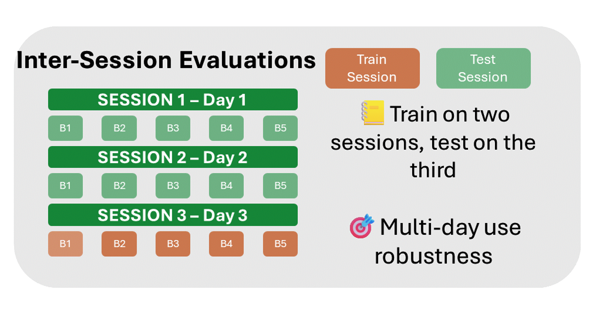
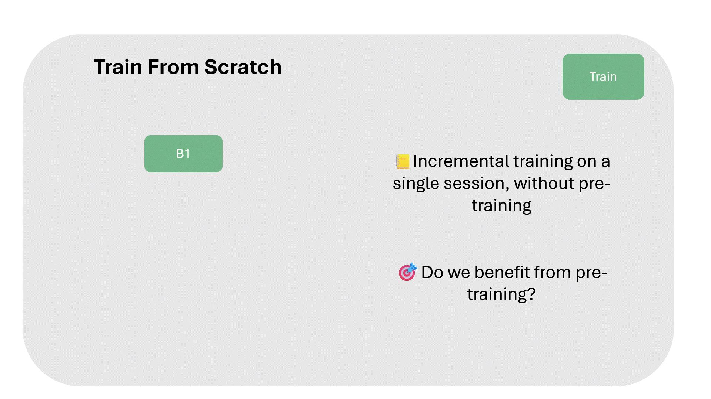
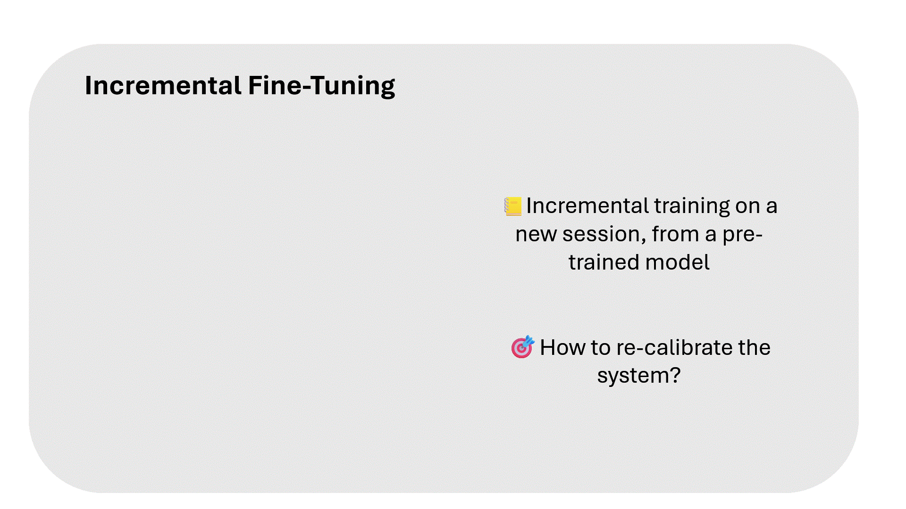

# SilentWear: an Ultra-Low Power Wearable System for EMG-based Silent Speech Recognition

_Silent-Wear_ is an end-to-end, fully open-source wearable system for _vocalized_ and _silent_ speech detection from surface electromyography (sEMG) data.

<table align="center">
<tr>
  <td align="center">
<br>
</td>
<td align="center">
<br>
</td>
</tr>
</table>

## 👨‍💻 Contributors

_Silent-Wear_ has been developed at _ETH Zürich_, by the [PULP-Bio](https://iis-projects.ee.ethz.ch/index.php?title=Biomedical_Circuits,_Systems,_and_Applications) team:

- [Giusy Spacone](https://scholar.google.com/citations?user=dGE8uMEAAAAJ&hl=en): Conceptualization, Experimental Design, Development
- [Sebastian Frey](https://scholar.google.com/citations?user=7jhiqz4AAAAJ&hl=en): PCB design, Firmware, Documentation
- Fiona Meier: Hardware Development
- [Giovanni Pollo](https://scholar.google.com/citations?hl=it&user=znSV3doAAAAJ&view_op=list_works&sortby=pubdate): Experimental Desing, Data Collection, Documentation

- Prof. [Luca Benini](https://scholar.google.com/citations?user=8riq3sYAAAAJ&hl=en): Supervision, Conceptualization
- Dr. [Andrea Cossettini](https://scholar.google.com/citations?user=d8O91jIAAAAJ&hl=en): Supervision, Project administration

## ⚙️ General Overview of the System

_Silent-Wear_ relies on the following building blocks:

🔧 **BIOGAP-Ultra** — an ultra-low-power acquisition system for biopotential acquisition.
Hardware and firmware: https://github.com/pulp-bio/BioGAP

📿 **Silent-Wear neckband** — a 14-channel differential EMG neckband.
System overview: https://ieeexplore.ieee.org/abstract/document/11330464 (arXiv: https://arxiv.org/abs/2509.21964)

🖥️ **BIOGUI** — a modular PySide6 GUI for acquiring and visualizing biosignals from multiple sources, and for managing data collection.
Version used in this work: https://github.com/pulp-bio/biogui/tree/sensors_speech

📝 **This repository**
This repository contains the source code used to preprocess EMG data and develop models that predict _8 HMI_ commands from _vocalized_ and _silent_ EMG, in line with the associated paper (arXiv: coming soon).

Specifically, it allows you to:

1. **Preprocess EMG data** and prepare it for model training using our publicly available dataset: https://huggingface.co/datasets/PulpBio/SilentWear
2. **Replicate the results** reported in the paper (arXiv: coming soon). See details below.
3. **Extend the pipeline** with your own models (instructions below).

## 🛠 Get Started: Environment Setup

Start by creating a dedicated virtual environment:

If using **conda**

```bash
conda create -n silent_wear python=3.11.9
conda activate silent_wear
```

If using **venv**

```bash
python3.11 -m venv silent_wear
source silent_wear/bin/activate
```

Clone this repository and install the required dependencies:

```bash
git clone <REPO_URL>
cd SilentWear
pip install -r requirements.txt
```

## 🗃️ Download the Data

You can download the data used in this work from: https://huggingface.co/datasets/PulpBio/SilentWear

The code expects the Hugging Face release layout:

```text
SilentWear/
├── data_raw_and_filt/
└── wins_and_features/
```

Further description on the content of the dataset are available at: https://huggingface.co/datasets/PulpBio/SilentWear/blob/main/README.md
Before running the experiments, updates the data paths in:

```bash
config/paper_models_config.yaml
config/create_windows.yaml
```

If you want to collect your own data using the [BioGUI](https://github.com/pulp-bio/biogui/tree/sensors_speech), see **Optional: raw data preprocessing** below.

## 📊 Reproduce Paper Results

The `reproduce_paper_scripts` folder allows to reproduce the results of the paper: (arXiv: coming soon) . </br>

### 1️⃣: Prepare EMG-windows and (optionally) features

```bash
cd reproduce_paper_scripts
python 20_make_windows_and_features.py --data_dir ./path_to_your_data
```

This script is responsible to:

- Reading EMG recordings (saved as .h5 files)

- Generates time windows with user-selectable lengths

- (Optionally) extracting time-domain and frequency-domain features for classical ML models

### 2️⃣: Run Experiments

In our work, we conduct four experiments:

#### 1. Global Evaluation Setting

<p align="left">
  
</p>

Train **Random Forest** models:

```bash
python reproduce_paper_scripts/30_run_experiments.py --base_config config/paper_models_config.yaml --model_config config/models_configs/random_forest_config.yaml --data_dir ./data --artifacts_dir ./artifacts --experiment global
```

Train **SpeechNet** models:

```bash
python reproduce_paper_scripts/30_run_experiments.py --base_config config/paper_models_config.yaml --model_config config/models_configs/speechnet_config.yaml --data_dir ./data --artifacts_dir ./artifacts --experiment global
```

#### Inter-Session Evaluation Setting

<p align="left">
  
</p>

Train **Random Forest** models:

```bash
python reproduce_paper_scripts/30_run_experiments.py --base_config config/paper_models_config.yaml --model_config config/models_configs/random_forest_config.yaml --data_dir ./data --artifacts_dir artifacts --experiment inter_session --inter_session_windows_s 1.4
```

Train **SpeechNet** models:

```bash
python reproduce_paper_scripts/30_run_experiments.py --base_config config/paper_models_config.yaml --model_config config/models_configs/speechnet_config.yaml --data_dir ./data --artifacts_dir artifacts --experiment inter_session
```

Note: this will run by default all the ablations on the window size. Window sizes: [0.4, 0.6, 0.8, 1.0, 1.2, 1.4].

You can pass a single float value to `inter_session_windows_s` if you want to train only on one specific window size.

#### Training From Scratch

<p align="left">
  
</p>

```bash
python reproduce_paper_scripts/30_run_experiments.py --base_config config/paper_models_config.yaml --model_config config/models_configs/speechnet_config.yaml --data_dir ./data --artifacts_dir artifacts --experiment train_from_scratch --tfs_config config/paper_train_from_scratch_config.yaml --tfs_windows_s 1.4
```

Adjust `tfs_windows_s` to select a different window size.

#### Inter-Session Fine Tuning

<p align="left">
  
</p>

```bash
python reproduce_paper_scripts/30_run_experiments.py --base_config config/paper_models_config.yaml --model_config config/models_configs/speechnet_config.yaml --data_dir ./data --artifacts_dir artifacts --experiment inter_session_ft --ft_config config/paper_ft_config.yaml --ft_windows_s 1.4
```

Adjust `ft_windows_s` to select a different window size.

### 3️⃣: Generate results

Run these commands to generate the results

#### Global / Inter Session Experiments Results

Random Forest:

```bash
python utils/III_results_analysis/I_global_intersession_analysis.py --artifacts_dir ./artifacts --experiment global --model_name random_forest --model_name_id w1400ms
```

SpeechNet:

```bash
  python utils/III_results_analysis/I_global_intersession_analysis.py --artifacts_dir ./artifacts --experiment global --model_name speechnet --model_name_id w1400ms --plot_confusion_matrix --transparent
```

Switch experiment between global and inter_session.

#### ITR on SpeechNet

```bash
  python utils/III_results_analysis/II_infotransrate.py --artifacts_dir ./artifacts --experiment inter_session --model_name speechnet
```

#### Fine-Tuning + From -Scratch Evaluations

```bash
python utils/III_results_analysis/III_ft_results.py --artifacts_dir ./artifacts --model_name speechnet --model_base_id w1400ms --inter_session_model_id model_1 --ft_id ft_config_0 --bs_id bs_config_0
```

Note:

If you ran multiple fine tuning or baseline rounds for the same window size, adjust ft_id and bs_id accordingly.
If you ran the inter session models multiple times, change the inter_session_model_id

---

Note: Small performance variations may occur due to randomness but remain within the reported standard deviation.

## 🎲 Running with Multiple Seeds

All experiments can be repeated with different random seeds, and the results pooled across seeds.

### What the seed controls

A single run seed `s` (`--seed s`) sets every source of randomness of a run; the test sets are fixed by the evaluation protocol and do not depend on it:

| Random element | Value |
| --- | --- |
| Model initialisation, dropout, batch order (PyTorch) | `s` |
| NumPy / Python `random` | `s - 42` |
| Rest-class downsampling, train/validation split | `s` |
| Random Forest `random_state` | `s - 42` |
| Label permutation (random-label control) | `s` |

`s = 42` (the default) reproduces the single-seed setup. Seeds are reset before every model is built and data files are loaded in sorted order, so a result does not depend on which other experiments ran before it in the same process. The seeds actually used are stored in every `run_cfg.json`.

`--seed` is available in `reproduce_paper_scripts/30_run_experiments.py`, `offline_experiments/V_random_label_control.py` and `offline_experiments/VI_subject_scaling_experiment.py`. Use one artifacts folder per seed, e.g.:

```bash
python reproduce_paper_scripts/30_run_experiments.py --base_config config/paper_models_config.yaml --model_config config/models_configs/speechnet_config.yaml --data_dir ./data --artifacts_dir ./artifacts/seed_52 --experiment global --seed 52
```

### Run all experiments for one seed

`40_run_seed_job.sh` runs one group of experiments for one seed into `<artifacts_root>/seed_<s>/` and logs it:

```bash
bash reproduce_paper_scripts/40_run_seed_job.sh <seed> <job> <data_dir> <win_and_feats> <artifacts_root>
# e.g.
bash reproduce_paper_scripts/40_run_seed_job.sh 52 global_and_rf ./data wins_and_features ./artifacts
```

| Job | Experiments |
| --- | --- |
| `global_and_rf` | Global SpeechNet, Global Random Forest, Inter-Session Random Forest (1400 ms) |
| `inter_session_sweep` | Inter-Session SpeechNet, windows 0.4–1.4 s |
| `ft_and_tfs` | Inter-Session Fine Tuning + Training From Scratch (800 and 1400 ms) |
| `random_labels` | Random-label control (inter-session SpeechNet, train/validation labels permuted) |
| `scaling_silent`, `scaling_vocalized` | Subject-scaling analysis (pre-training on 0–3 other subjects, then zero-shot or fine-tuning on 1–2 sessions of the target subject) |
| `cross_modal` | Cross-modal evaluation: the Inter-Session SpeechNet models (1400 ms) are tested on the same held-out session of the other mode (vocalized → silent, silent → vocalized); inference only, run after `inter_session_sweep` |

`<win_and_feats>` is the name of the windows folder inside `<data_dir>` (`wins_and_features` for the released dataset). Each job appends a row (start, end, seed, job, git commit, exit code, log) to `<artifacts_root>/runs_manifest.csv`. Jobs are independent and can run in parallel, also on different GPUs (`CUDA_VISIBLE_DEVICES`).

Resulting layout:

```
<artifacts_root>/
├── seed_42/  {models, tables, figures, logs}
├── seed_52/  ...
├── seed_62/  ...
├── seeds_pooled/  {models, tables, figures, seed_spread}   (after pooling)
└── runs_manifest.csv
```

### Pool seeds and generate results

```bash
bash reproduce_paper_scripts/50_analyze_seeds.sh ./artifacts 42 52 62
```

This script

1. **pools** the seeds with `utils/III_results_analysis/00_pool_seeds.py` into `seeds_pooled/models/`, a tree with the same layout as a single-seed run: every per-fold (or per-session, per-batch) value is the mean over seeds of the same fold. Confusion matrices are averaged element-wise; since the test set of a fold is identical across seeds, this equals normalising the summed counts. Per-window predictions are not pooled. Pooling fails if a run is missing for any seed or if the test folds differ;
2. **analyses** every `seed_<s>/` and `seeds_pooled/` with the scripts of step 3️⃣ (plus `IV_subject_scaling_analysis.py` and `V_confusion_matrix_figure.py`, which assembles all SpeechNet confusion matrices into the single paper figure `figures/speechnet_w1400ms_cm_global_inter_session.svg`), producing the usual `tables/` and `figures/`;
3. computes the **seed spread**: `seeds_pooled/seed_spread/<table>.csv` contains, for every table, the mean and standard deviation *across seeds* of each reported value.

In the pooled tables and figures, standard deviations keep the meaning of the single-seed results (across folds or sessions for each subject, across subjects for the average); the variability due to the seed is reported separately in `seed_spread/`.

## Run minimal experiments.

The `reproduce_paper_scripts` folder is built around the standalone scripts contained in:

- `utils/II_feature_extraction` and `utils/III_results_analysis`

- `offline_experiments`

The scripts in these folder can be ran independently.

They can be used as a starting point to **test your own model**.

## Extras: raw data preprocessing (only if you collected new data)

If you recorded new data using the [BioGUI](https://github.com/pulp-bio/biogui/tree/sensors_speech), you can convert your `.bio` recordings to `.h5` using:

```text
utils/I_data_preparation/data_preparation.py
```

Then run windowing/feature extraction as above.

---

## 🤝 Contributing

_Silent-Wear_ aims to foster a community-driven effort toward advancing EMG-based Human–Machine Interfaces (HMI).

We strongly encourage contributions from researchers, developers, and practitioners.

You can contribute in several ways:

---

### 📊 1. Collect and Share Your Own Data

You can replicate the data collection protocol using the open-source **BIOGUI** platform:

https://github.com/pulp-bio/biogui/tree/sensors_speech

We welcome:

- New subjects
- Additional commands
- Different recording conditions
- Cross-lingual or multilingual datasets

If you collect new data, please open an issue to discuss integration.

### 🧠 2. Develop and Integrate Your Own Models

To integrate a new model:

1. Add your configuration file under `config/models_configs/`
2. Implement your model in the `models/` directory
3. Add your model factory to `models/models_factory.py` file
4. Submit a pull request with a short description of your approach and results

### 🛠 3. Improve the Pipeline

Contributions are also welcome for:

- Data preprocessing
- Feature extraction
- Evaluation protocols
- Documentation improvements
- Bug fixes and performance optimizations

## Citation

If you use this work, we strongly encourage you to cite:

```bibtex
@article{spacone2026silentwear,
  title={SilentWear: an Ultra-Low Power Wearable System for EMG-based Silent Speech Recognition},
  author={Spacone, Giusy and Frey, Sebastian and Pollo, Giovanni and Burrello, Alessio and Pagliari, Daniele Jahier and Kartsch, Victor and Cossettini, Andrea and Benini, Luca},
  journal={arXiv preprint arXiv:2603.02847},
  year={2026}
}
```

```bibtex
@INPROCEEDINGS{meier_wearneck_26,
  author={Meier, Fiona and Spacone, Giusy and Frey, Sebastian and Benini, Luca and Cossettini, Andrea},
  booktitle={2025 IEEE SENSORS},
  title={A Parallel Ultra-Low Power Silent Speech Interface Based on a Wearable, Fully-Dry EMG Neckband},
  year={2025},
  volume={},
  number={},
  pages={1-4},
  keywords={Wireless communication;Vocabulary;Wireless sensor networks;Accuracy;Low power electronics;Electromyography;Robustness;Decoding;Wearable sensors;Textiles;EMG;wearable;ultra-low power;HMI;speech;silent speech},
  doi={10.1109/SENSORS59705.2025.11330464}}
```

```bibtex
@ARTICLE{11346484,
  author={Frey, Sebastian and Spacone, Giusy and Cossettini, Andrea and Guermandi, Marco and Schilk, Philipp and Benini, Luca and Kartsch, Victor},
  journal={IEEE Transactions on Biomedical Circuits and Systems},
  title={BioGAP-Ultra: A Modular Edge-AI Platform for Wearable Multimodal Biosignal Acquisition and Processing},
  year={2026},
  volume={},
  number={},
  pages={1-17},
  keywords={Electrocardiography;Biomedical monitoring;Monitoring;Electromyography;Electroencephalography;Artificial intelligence;Heart rate;Estimation;Temperature measurement;Hardware;biopotential;ExG;photoplethysmogram;Human-Machine Interface;sensor fusion},
  doi={10.1109/TBCAS.2026.3652501}}
```

## 📄 License

This project makes use of the following licenses:

- Apache License 2.0 — see the [LICENSE](LICENSE) file for details.

- Images (`extras/`) are under the the Creative Commons Attribution 4.0 International License - see the [LICENSE_IMG](LICENSE.images) file for details.
